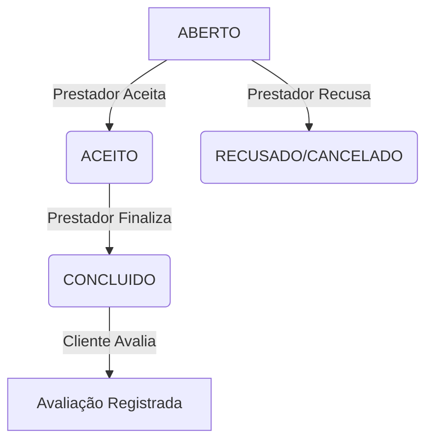

# 🔄 Workflow e Ciclo de Vida (Pedido)

O `PedidoServico` funciona como uma máquina de estados finita. As transições são estritas para garantir a consistência financeira e operacional do serviço.

## 1. Diagrama de Estados

## ⭐ Avaliações (Reviews)

Após a conclusão de um pedido, o cliente pode avaliar o serviço prestado.

### Regras
- Apenas pedidos com status **CONCLUIDO** podem ser avaliados.
- Cada pedido pode ser avaliado **apenas uma vez**.
- Somente o **cliente** pode avaliar o serviço (versão atual).
- A avaliação é associada ao pedido e ao prestador do serviço.

### Efeitos
- A avaliação impacta a reputação pública do prestador.
- A avaliação fica visível no perfil do negócio/prestador.
