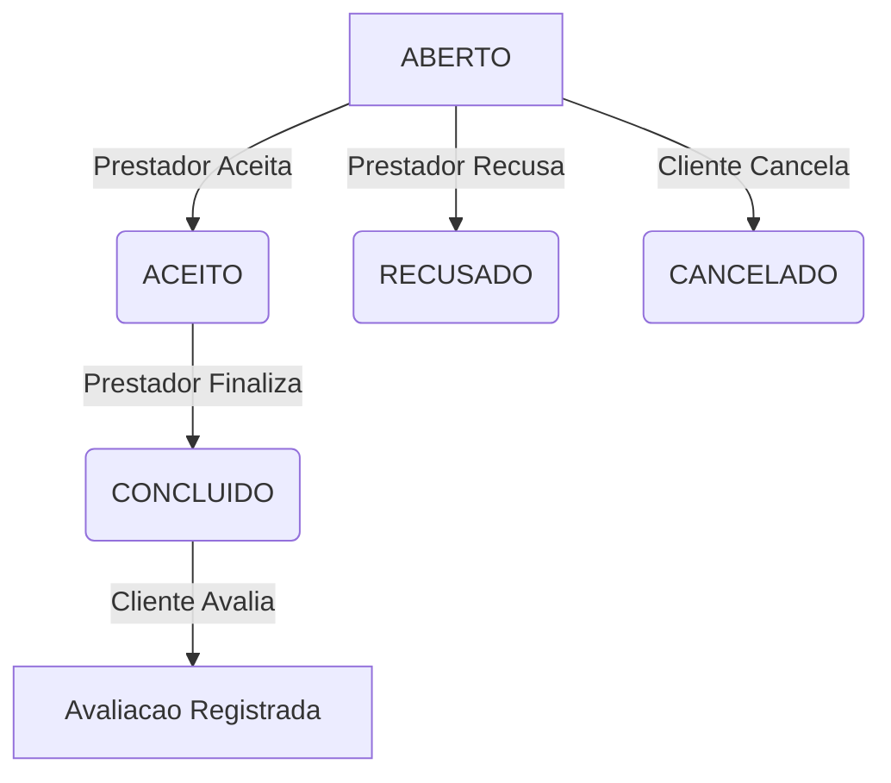

# Workflow e Ciclo de Vida (Pedido)

O `PedidoServico` funciona como uma maquina de estados finita. As transicoes sao estritas para garantir a consistencia do servico.

## 1. Diagrama de Estados

## 2. Transicoes Validas

| De | Para | Quem | Endpoint |
|----|------|------|----------|
| ABERTO | ACEITO | Prestador | `PATCH /pedidos/{id}/aceitar` |
| ABERTO | RECUSADO | Prestador | `PATCH /pedidos/{id}/recusar` |
| ABERTO | CANCELADO | Cliente | `PATCH /pedidos/{id}/cancelar` |
| ACEITO | CONCLUIDO | Prestador | `PATCH /pedidos/{id}/concluir` |

**Regra de Ouro:** Nao e possivel concluir um pedido que nao foi aceito.

## 3. Avaliacoes (Reviews)

Apos a conclusao de um pedido, o cliente pode avaliar o servico prestado.

### Regras
- Apenas pedidos com status **CONCLUIDO** podem ser avaliados.
- Cada pedido pode ser avaliado **apenas uma vez**.
- Somente o **cliente** pode avaliar o servico.
- A avaliacao e associada ao pedido e ao negocio.
- A nota media do negocio e recalculada automaticamente.

### Endpoint
`POST /avaliacoes/pedido/{pedidoId}` com `{ nota: 1-5, comentario?: "..." }`

## 4. Busca Inteligente

1. Usuario envia localizacao (lat, lon)
2. Backend calcula distancia via Haversine (raio 30km)
3. Negocios sem coordenadas sao excluidos
4. Ordena por avaliacao
5. Retorna lista otimizada para UX

## 5. Fluxo Completo V1 (Backend -> App)

1. Usuario faz cadastro (`POST /usuarios`)
2. Usuario faz login (`POST /auth/login`)
3. App recebe JWT
4. App chama `GET /usuarios/me`
5. App carrega avatar, nome e permissoes
6. Cliente busca negocios (`GET /negocios/busca?lat=X&lon=Y`)
7. Cliente cria pedido (`POST /pedidos`)
8. Chat via WebSocket (`/ws-chat`)
9. Prestador aceita/recusa/conclui pedido
10. Cliente avalia (`POST /avaliacoes/pedido/{id}`)

### Fluxo de Recuperacao de Senha

1. Usuario solicita reset (`POST /auth/esqueci-senha`)
2. Recebe codigo de 6 digitos por email (expira em 15 min)
3. Envia codigo + nova senha (`POST /auth/redefinir-senha`)
4. Faz login com a nova senha